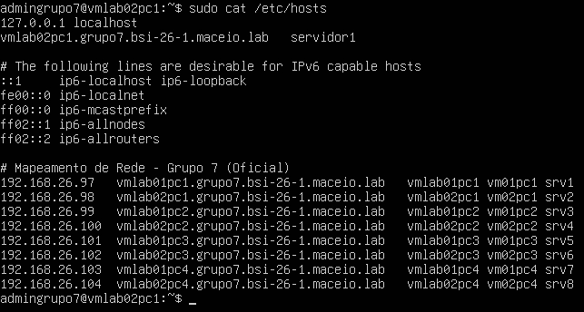

# Instituto Federal de Alagoas
## Fundamentos de redes de computadores
## Grupo7
Emerson Gomes Vanderlei da Silva <br>Tainá Ferreira Miranda <br>Matheus Azafhi Goes de Souza <br>Heitor Moreira Costa

---

## Sumário
* [1. Planejamento da Infraestrutura e Hardware](#1-planejamento-da-infraestrutura-e-hardware)
* [2. Arquitetura de Endereçamento IP (Sub-rede /28)](#2-arquitetura-de-endereçamento-ip-sub-rede-28)
  * [2.1 Descobrindo o tamanho dos blocos](#21-descobrindo-o-tamanho-dos-blocos)
  * [2.2 Mapeamento das Sub-redes (Como chegamos ao Grupo 7)](#22-mapeamento-das-sub-redes-como-chegamos-ao-grupo-7)
  * [2.3 Anatomia da Faixa do Grupo 7](#23-anatomia-da-faixa-do-grupo-7)
  * [2.4 Distribuição de Endereçamento IP do Grupo](#24-distribuição-de-endereçamento-ip-do-grupo)
* [3. Nomenclatura, Mapeamento Local e Domínio (FQDN)](#3-nomenclatura-mapeamento-local-e-domínio-fqdn)
  * [3.1 Estrutura Prática do Arquivo `/etc/hosts`](#31-estrutura-prática-do-arquivo-etchosts)
* [4. Usuários e senhas](#4-provisionamento-de-usuários-e-segurança)
  * [4.1 Criação de Contas e Atribuição de Privilégios](#41-criação-de-contas-e-atribuição-de-privilégios)
* [5. Configuração de Rede com Netplan](#5-configuração-de-rede-com-netplan)
  * [5.1 Estrutura e Sintaxe do Netplan](#51-estrutura-e-sintaxe-do-netplan)
  * [5.2 Configuração Aplicada no Grupo 7](#52-configuração-aplicada-no-grupo-7)
  * [5.3 Passo a Passo para Configuração no Ubuntu Server](#53-passo-a-passo-para-configuração-no-ubuntu-server)
  * [5.4 Prints da Configuração Netplan Aplicada](#54-prints-da-configuração-netplan-aplicada)
* [6. Prints de ping](#6-prints-de-ping)
  * [6.1 PC1](#61-pc1)
    * [6.1.1 Ping com FQDN](#611-ping-com-fqdn)
    * [6.1.2 Ping com hostname](#612-ping-com-hostname)
    * [6.1.3 Ping com IP](#613-ping-com-ip)
  * [6.2 PC2](#62-pc2)
    * [6.2.1 Ping com FQDN](#621-ping-com-fqdn)
    * [6.2.2 Ping com hostname](#622-ping-com-hostname)
    * [6.2.3 Ping com IP](#623-ping-com-ip)
  * [6.3 PC3](#63-pc3)
    * [6.3.1 Ping com FQDN](#631-ping-com-fqdn)
    * [6.3.2 Ping com hostname](#632-ping-com-hostname)
    * [6.3.3 Ping com IP](#633-ping-com-ip)
  * [6.4 PC4](#64-pc4)
    * [6.4.1 Ping com FQDN](#641-ping-com-fqdn)
    * [6.4.2 Ping com hostname](#642-ping-com-hostname)
    * [6.4.3 Ping com IP](#643-ping-com-ip)
* [7. Conexão SSH](#7-conexão-ssh)

---

# Tabelas de Configuração de Hardware, Endereçamento e Domínio

## 1. Planejamento da Infraestrutura e Hardware

Para garantir a replicação idêntica deste laboratório, cada uma das 8 Máquinas Virtuais (MVs) deve ser criada no VirtualBox utilizando estritamente a seguinte especificação técnica:

| Componente | Configuração por VM | Função no Laboratório |
| :--- | :--- | :--- |
| **Sistema Operacional** | Ubuntu Server 26.04 LTS | Sistema operacional base (sem interface gráfica). |
| **Processador (vCPU)** | 1 Core / 1 Processador | Suficiente para a execução de serviços básicos CLI. |
| **Memória RAM** | 2048 MB (2GB) | Alocação ideal para evitar travamentos em sistemas locais. |
| **Disco Rígido (HD)** | 25 GB (Alocação Dinâmica) | Espaço para armazenamento de logs e arquivos do sistema. |
| **Placa de Rede** | 1 Interface em Modo Bridge | Vinculada à interface física ativa (Wi-Fi ou Cabo) do host real. |

---

## 2. Arquitetura de Endereçamento IP (Sub-rede /28)

A turma utilizou a rede mãe `192.168.26.0/24`. Seguindo a regra de segmentação, o **Grupo 7** recebeu a 7ª sub-rede calculada através da máscara de sub-rede `/28` (`255.255.255.240`), o que nos fornece blocos de 16 endereços IP (14 úteis para hosts).

### Memória de Cálculo e Regra de Segmentação

Para fatiar a rede mãe `192.168.26.0/24` em sub-redes menores para a turma, utilizamos a técnica de CIDR (Classless Inter-Domain Routing) com a máscara `/28`. 

#### 2.1 Descobrindo o tamanho dos blocos
A máscara `/24` original possui 24 bits destinados à rede e 8 bits para os hosts. Ao alterá-la para `/28`, "pegamos emprestado" 4 bits da parte dos hosts para criar as sub-redes.

* **Máscara em bits:** `11111111.11111111.11111111.11110000` (28 bits ligados)
* **Máscara em formato decimal:** `255.255.255.240`
* **Quantidade de sub-redes possíveis ($2^n$):** Como pegamos 4 bits emprestados ($n=4$), temos $2^4 = 16$ sub-redes disponíveis para a turma.
* **Tamanho de cada bloco ($2^h$):** Como restaram 4 bits para os hosts ($32 - 28 = 4$), cada sub-rede terá um tamanho fixo de $2^4 = 16$ endereços IP totais.

Cada bloco perde sempre 2 endereços IPs obrigatórios (o primeiro é o ID da Rede e o último é o Broadcast), restando exatamente **14 IPs úteis** para configurar as máquinas.

#### 2.2 Mapeamento das Sub-redes (Como chegamos ao Grupo 7)
Sabendo que os blocos saltam de 16 em 16 números no último octeto, a divisão oficial das sub-redes da turma ficou organizada da seguinte forma:

* **Sub-rede 1 (Grupo 1):** `192.168.26.0` a `192.168.26.15`
* **Sub-rede 2 (Grupo 2):** `192.168.26.16` a `192.168.26.31`
* **Sub-rede 3 (Grupo 3):** `192.168.26.32` a `192.168.26.47`
* **Sub-rede 4 (Grupo 4):** `192.168.26.48` a `192.168.26.63`
* **Sub-rede 5 (Grupo 5):** `192.168.26.64` a `192.168.26.79`
* **Sub-rede 6 (Grupo 6):** `192.168.26.80` a `192.168.26.95`
* **Sub-rede 7 (Grupo 7):** **`192.168.26.96` a `192.168.26.111`** 👈 *Nossa faixa alocada*
* **Sub-rede 8 (Grupo 8):** `192.168.26.112` a `192.168.26.127`
*(... e assim por diante até a Sub-rede 16)*

#### 2.3 Anatomia da Faixa do Grupo 7
Aplicando as regras do protocolo IPv4 sobre o nosso bloco, mapeamos os seguintes parâmetros de rede:

* **ID de Rede (Endereço de Rede):** `192.168.26.96` (Identifica a nossa sub-rede no roteamento, não pode ser atribuído a nenhuma máquina).
* **Primeiro IP utilizável:** `192.168.26.97` (Atribuído à primeira VM do projeto).
* **Último IP utilizável:** `192.168.26.110` (Limite físico utilizável para hosts nesta rede).
* **Endereço de Broadcast:** `192.168.26.111` (Utilizado para comunicação simultânea com todos os hosts da sub-rede).

---

> ℹ️ **Nota:** Embora o cálculo de sub-rede `/28` disponibilize um total de 14 endereços IP válidos para hosts (de `.97` a `.110`), este laboratório utilizará estritamente **8 endereços IP** (de `.97` a `.104`), cumprindo o requisito de provisionar exatamente 8 Máquinas Virtuais para o cenário proposto. Os 6 endereços restantes (`.105` a `.110`) permanecem livres para futuras expansões da rede.

### 2.4 Distribuição de Endereçamento IP do Grupo

Abaixo está a distribuição de IP fixa adotada e distribuída entre as máquinas físicas (Hosts) dos integrantes da equipe para as 8 MVs do projeto:

| Máquina Virtual | Host Físico | Nome do Host (Hostname) | Endereço IP / Máscara |
| :--- | :--- | :--- | :--- |
| VM Lab01@PC1 | PC1 (Emerson) | `vmlab01pc1` | 192.168.26.97/28 |
| VM Lab02@PC1 | PC1 (Emerson) | `vmlab02pc1` | 192.168.26.98/28 |
| VM Lab01@PC2 | PC2 (Tainá) | `vmlab01pc2` | 192.168.26.99/28 |
| VM Lab02@PC2 | PC2 (Tainá) | `vmlab02pc2` | 192.168.26.100/28 |
| VM Lab01@PC3 | PC3 (Matheus) | `vmlab01pc3` | 192.168.26.101/28 |
| VM Lab02@PC3 | PC3 (Matheus) | `vmlab02pc3` | 192.168.26.102/28 |
| VM Lab01@PC4 | PC4 (Heitor) | `vmlab01pc4` | 192.168.26.103/28 |
| VM Lab02@PC4 | PC4 (Heitor) | `vmlab02pc4` | 192.168.26.104/28 |

## 3. Nomenclatura, Mapeamento Local e Domínio (FQDN)

Como não há um servidor DNS ativo nesta rede virtualizada, a resolução de nomes é realizada de maneira estática em nível de sistema operacional. O domínio obrigatório do projeto segue o formato padrão `<grupoX>.bsi-26-1.maceio.lab`.

A tabela abaixo apresenta o planejamento completo de nomes de domínio, hostnames e todos os apelidos (*aliases*) associados a cada endereço IP que compõem o nosso laboratório:

| Endereço IP | Nome de Domínio Completo (FQDN) | Apelidos / Nomes Curtos (Aliases) |
| :--- | :--- | :--- |
| 192.168.26.97 | `vmlab01pc1.grupo7.bsi-26-1.maceio.lab` | vmlab01pc1, vm01pc1, srv1 |
| 192.168.26.98 | `vmlab02pc1.grupo7.bsi-26-1.maceio.lab` | vmlab02pc1, vm02pc1, srv2 |
| 192.168.26.99 | `vmlab01pc2.grupo7.bsi-26-1.maceio.lab` | vmlab01pc2, vm01pc2, srv3 |
| 192.168.26.100 | `vmlab02pc2.grupo7.bsi-26-1.maceio.lab` | vmlab02pc2, vm02pc2, srv4 |
| 192.168.26.101 | `vmlab01pc3.grupo7.bsi-26-1.maceio.lab` | vmlab01pc3, vm01pc3, srv5 |
| 192.168.26.102 | `vmlab02pc3.grupo7.bsi-26-1.maceio.lab` | vmlab02pc3, vm02pc3, srv6 |
| 192.168.26.103 | `vmlab01pc4.grupo7.bsi-26-1.maceio.lab` | vmlab01pc4, vm01pc4, srv7 |
| 192.168.26.104 | `vmlab02pc4.grupo7.bsi-26-1.maceio.lab` | vmlab02pc4, vm02pc4, srv8 |

---

### 3.1 Estrutura Prática do Arquivo `/etc/hosts`

Para materializar esse planejamento no ecossistema Linux, o arquivo `/etc/hosts` foi editado em cada nó utilizando a sintaxe nativa: `IP [FQDN] [Aliases...]`. Esse arquivo deve ser mantido **idêntico** em todas as 8 máquinas virtuais para garantir que o mapeamento seja bidirecional e uniforme em toda a sub-rede.

Abaixo está a evidência da configuração implementada diretamente no arquivo do sistema operacional, inspecionada através do comando `cat`:



>**Nota de Instrução para Replicação:** No Linux, qualquer alteração realizada no arquivo `/etc/hosts` tem efeito imediato na resolução de rede local, dispensando a necessidade de reiniciar a interface de rede ou a máquina virtual para que os apelidos (como `srv1` ou `vm01pc1`) comecem a responder aos comandos de rede.

---

## 4. Provisionamento de Usuários e Segurança

Em todas as máquinas virtuais, foram estruturadas contas de gerenciamento com diferentes níveis de privilégios, divididas entre administradores locais da instituição, administradores do grupo e contas individuais de uso comum para simular os acessos dos integrantes da equipe.

* **Administradores do Sistema (Acesso Root/Sudo):**
  * `adminifal` | Senha: `adminifal`
  * `admingrupo7` | Senha: `0123456789`
* **Usuários dos Integrantes (Contas Comuns):**
  * `taina.ferreira` | Senha: `0123456789@`
  * `matheus.souza` | Senha: `0123456789@`
  * `heitor.costa` | Senha: `0123456789@`
  * `emerson.silva` | Senha: `0123456789@`

---

### 4.1 Criação de Contas e Atribuição de Privilégios

Reproduzir procedimentos abaixo no terminal:

1. **Criação das contas comuns e administrativas:**
  Crie o usuário comum e, em seguida, adicione-o ao grupo `sudo` para conceder privilégios administrativos:
  ```bash
  # 1. Cria a conta comun do administrador
  sudo adduser adminifal
  # 2. Concede privilégios administrativos adicionando o usuário ao grupo sudo
  sudo usermod -aG sudo adminifal
  ```

## 5. Configuração de Rede com Netplan

O Netplan é a ferramenta padrão de configuração de rede no Ubuntu Server. Ela utiliza um arquivo de configuração no formato **YAML** (um acrônimo recursivo para "YAML Ain't Markup Language") para definir as interfaces de rede de forma declarativa e simplificada.

### 5.1 Estrutura e Sintaxe do Netplan

Os arquivos de configuração do Netplan estão localizados no diretório `/etc/netplan/` e geralmente possuem extensão `.yaml`. A sintaxe básica segue o seguinte padrão:

  ```yaml
  network:
    version: 2
    ethernets:
      <nome_da_interface>:
        dhcp4: true/false
        addresses:
          - <IP>/<máscara>
        nameservers:
          addresses: [<DNS1>, <DNS2>]
        routes:
          - to: default
            via: <gateway>
  ```

### Componentes principais da sintaxe YAML

| Elemento              | Descrição                                                                                     |
| --------------------- | --------------------------------------------------------------------------------------------- |
| `network:`            | Nó raiz que define o início da configuração de rede.                                          |
| `version: 2`          | Versão da sintaxe do Netplan (atualmente a versão 2 é a padrão).                              |
| `ethernets:`          | Seção que agrupa as interfaces de rede físicas (Ethernet).                                    |
| `<nome_da_interface>` | Identificador da interface (ex.: `enp0s3`, `eth0`). Pode ser descoberto com o comando `ip a`. |
| `dhcp4:`              | Define se a interface deve obter endereço IPv4 via DHCP (`yes/true`) ou  (`no/false`).            |
| `addresses:`          | Lista de endereços IP estáticos no formato `IP/máscara`.                                      |
| `nameservers:`        | Configura os servidores DNS.                                                                  |
| `routes:`             | Define rotas estáticas, sendo a rota padrão (`default`) a que aponta para o gateway.          |

### Regras importantes da sintaxe YAML

* **Indentação obrigatória:** O YAML utiliza espaços (não tabs) para definir hierarquia. Cada nível de indentação deve ter 2 ou 4 espaços (padrão: 2).
* **Sensível a maiúsculas/minúsculas:** Os nomes das chaves devem ser escritos exatamente como especificados.
* **Listas:** Utilizam o hífen (`-`) para elementos sequenciais, como múltiplos IPs ou DNS.
* **Dicionários:** Utilizam a sintaxe `chave: valor` com dois pontos e espaço.

### 5.2 Configuração Aplicada no Grupo 7

Para o nosso laboratório, cada máquina virtual possui um endereço IP fixo, utilizando o arquivo `/etc/hosts` para resolução de nomes. O arquivo de configuração do Netplan (`/etc/netplan/00-installer-config.yaml`) foi adaptado com a seguinte estrutura base:

  ```yaml
  network:
    version: 2
    ethernets:
      enp0s3:                  # Nome da interface de rede (pode variar)
        dhcp4: no           # Desativa o DHCP
        addresses:
          - 192.168.26.97/28   # IP estático com a máscara da sub-rede
        routes:
          - to: default
            via: 192.168.26.1  # Gateway da rede (roteador local)
        nameservers:
          addresses: [8.8.8.8, 8.8.4.4] # DNS opcional para acesso externo
  ```

### 5.3 Passo a Passo para Configuração no Ubuntu Server

Para configurar a rede via Netplan em cada máquina virtual, siga os procedimentos abaixo:

### 1. Identificar o nome da interface de rede

  ```bash
  ip a
  ```

Procure por interfaces como `enp0s3`, `eth0` ou similares.

### 2. Editar o arquivo de configuração

  ```bash
  sudo nano /etc/netplan/00-installer-config.yaml
  ```


### 3. Inserir a configuração específica da VM

Substitua o IP pelo endereço correspondente da máquina conforme a tabela de endereçamento do grupo.

### 4. Aplicar as configurações

  ```bash
  sudo netplan apply
  ```

Este comando valida a sintaxe do YAML e aplica as configurações às interfaces de rede.

### 5. Verificar a configuração aplicada

  ```bash
  ip a
  ```

O comando `ip a` exibe as interfaces de rede e seus endereços IP configurados.
### 5.4 Prints da Configuração Netplan Aplicada
### Netplan vmlab01pc1


### Netplan vmlab02pc1


### Netplan vmlab01pc2


### Netplan vmlab02pc2


### Netplan vmlab01pc3


### Netplan vmlab02pc3


### Netplan vmlab01pc4


### Netplan vmlab02pc4


---

## 6. Prints de ping

## 6.1 PC1

### 6.1.1 Ping com FQDN

### vmlab01pc1 para vm02pc1


### vmlab01pc1 para vm01pc3


### vmlab01pc1 para vm02pc3


### 6.1.2 Ping com hostname

### vmlab01pc1 para vm02pc1


### vmlab01pc1 para vm01pc3


### vmlab01pc1 para vm02pc3


### 6.1.3 Ping com IP

### vmlab01pc1 para vmlab02pc1


### vmlab01pc1 para vm01pc3


### vmlab01pc1 para vm02pc3

---

## 6.2 PC2

### 6.2.1 Ping com FQDN

### vmlab01pc2 para vm02pc2


### vmlab01pc1 para vm01pc4


### 6.2.2 Ping com hostname

### vmlab01pc2 para vm02pc2


### vmlab01pc1 para vm01pc4


### 6.2.3 Ping com IP

### vmlab01pc2 para vm02pc2


### vmlab01pc1 para vm01pc4


---

## 6.3 PC3

### 6.3.1 Ping com FQDN

### vmlab01pc3 para vm02pc3


### vmlab01pc3 para vm01pc4


### vmlab01pc3 para vm02pc4


### 6.3.2 Ping com hostname

### vmlab01pc3 para vm02pc3


### vmlab01pc3 para vm01pc4


### vmlab01pc3 para vm02pc4


### 6.3.3 Ping com IP

### vmlab01pc3 para vm01pc3


### vmlab01pc3 para vm01pc4


### vmlab01pc3 para vm01pc4


---

## 6.4 PC4

### 6.4.1 Ping com FQDN

### vmlab01pc4 para vm02pc4


### vmlab01pc4 para vm01pc2


### vmlab01pc4 para vm02pc2


### 6.4.2 Ping com hostname

### vmlab01pc4 para vm02pc4


### vmlab01pc4 para vm01pc2


### vmlab01pc4 para vm02pc2


### 6.4.3 Ping com IP

### vmlab01pc4 para vm02pc4


### vmlab01pc4 para vm01pc2


### vmlab01pc4 para vm02pc2


---

## 7. Conexão SSH
Nesta seção estão documentados os testes de acesso remoto via SSH, comprovando a conectividade entre os nós do Grupo 7 utilizando tanto o usuário administrador quanto os usuários dos integrantes da equipe.

---

### SSH vmlab01pc1 para vmlab1pc1


### SSH vmlab01pc1 para vmlab02pc1


### SSH vmlab01pc2 para vmlab02pc2


### SSH vmlab01pc3 para vmlab01pc4


### SSH vmlab01pc3 para vmlab02pc3


### SSH vmlab01pc3 para vmlab02pc4
