# Instituto Federal de Alagoas
## Fundamentos de redes de computadores
## Grupo7
Emerson Gomes Vanderlei da Silva
Tainá Miranda Ferreira
Matheus Azafhi Goes de Souza 
Heitor Moreira Costa

# Tabelas de Configuração de Hardware, Endereçamento e Domínio

# 1. Tabela de Hardware das VMs

| Componente | Configuração por VM |
| :--- | :--- |
| **Sistema Operacional** | Ubuntu Server 22.04 LTS |
| **Processador (vCPU)** | 1 Core/Processador |
| **Memória RAM** | 2048 MB (1GB) |
| **Disco Rígido (HD)** | 25 GB (Alocação Dinâmica) |
| **Placa de Rede** | 1 Interface em modo bridge |

---

## 2. Tabela de Endereçamento IP e Hardware

| Máquina Virtual | Host Físico | Nome do Host (Hostname) | Endereço IP / Máscara |
| :--- | :--- | :--- | :--- |
| VM Lab01@PC1 | PC1 | `vmlab01pc1` | 192.168.26.97/28 |
| VM Lab02@PC1 | PC1 | `vmlab02pc1` | 192.168.26.98/28 |
| VM Lab01@PC2 | PC2 | `vmlab01pc2` | 192.168.26.99/28 |
| VM Lab02@PC2 | PC2 | `vmlab02pc2` | 192.168.26.100/28 |
| VM Lab01@PC3 | PC3 | `vmlab01pc3` | 192.168.26.101/28 |
| VM Lab02@PC3 | PC3 | `vmlab02pc3` | 192.168.26.102/28 |
| VM Lab01@PC4 | PC4 | `vmlab01pc4` | 192.168.26.103/28 |
| VM Lab02@PC4 | PC4 | `vmlab02pc4` | 192.168.26.104/28 |

---

## 3. Tabela de Nomenclatura e Domínio (FQDN)

| Endereço IP | Hostname Curto | Nome de Domínio Completo (FQDN) | Apelidos (Aliases) |
| :--- | :--- | :--- | :--- |
| 192.168.26.97 | `vmlab01pc1` | `vmlab01pc1.grupo7.bsi-26-1.maceio.lab` | vm01pc1, srv1 |
| 192.168.26.98 | `vmlab02pc1` | `vmlab02pc1.grupo7.bsi-26-1.maceio.lab` | vm02pc1, srv2 |
| 192.168.26.99 | `vmlab01pc2` | `vmlab01pc2.grupo7.bsi-26-1.maceio.lab` | vm01pc2, srv3 |
| 192.168.26.100 | `vmlab02pc2` | `vmlab02pc2.grupo7.bsi-26-1.maceio.lab` | vm02pc2, srv4 |
| 192.168.26.101 | `vmlab01pc3` | `vmlab01pc3.grupo7.bsi-26-1.maceio.lab` | vm01pc3, srv5 |
| 192.168.26.102 | `vmlab02pc3` | `vmlab02pc3.grupo7.bsi-26-1.maceio.lab` | vm02pc3, srv6 |
| 192.168.26.103 | `vmlab01pc4` | `vmlab01pc4.grupo7.bsi-26-1.maceio.lab` | vm01pc4, srv7 |
| 192.168.26.104 | `vmlab02pc4` | `vmlab02pc4.grupo7.bsi-26-1.maceio.lab` | vm02pc4, srv8 |

## 4. Usuŕios e senhas
admingrupo7 = 0123456789

taina.ferreira = 0123456789@

matheus.souza = 0123456789@

heitor.costa = 0123456789@

emerson.silva = 0123456789@

## 5. Prints netplan

### Netplan vmlab01pc1

### Netplan vmlab02pc1

### Netplan vmlab01pc2

### Netplan vmlab02pc2

### Netplan vmlab01pc3

### Netplan vmlab02pc3

### Netplan vmlab01pc4

### Netplan vmlab02pc4

## 6. Prints de ping com alias

### vmlab01pc1 para vm02pc1

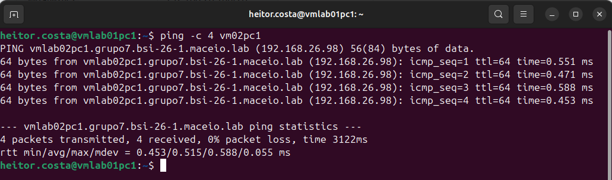

### vmlab01pc1 para vm01pc2

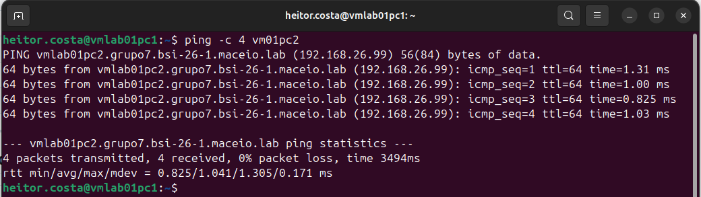

### vmlab01pc1 para vm02pc2

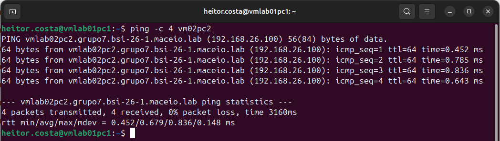

### vmlab01pc1 para vm01pc3

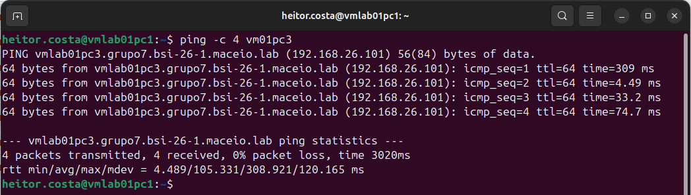

### vmlab01pc1 para vm02pc3

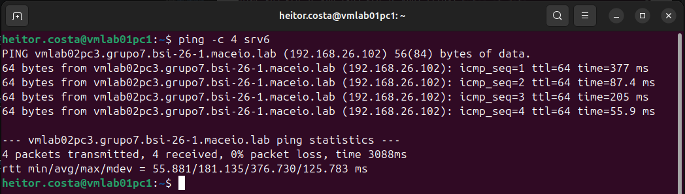

### vmlab01pc1 para vm01pc4

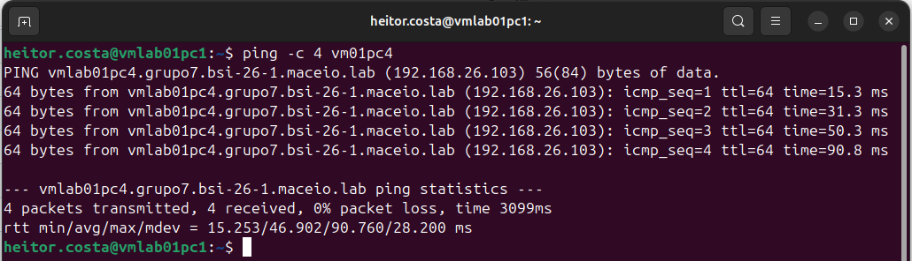

### vmlab01pc1 para vm02pc4

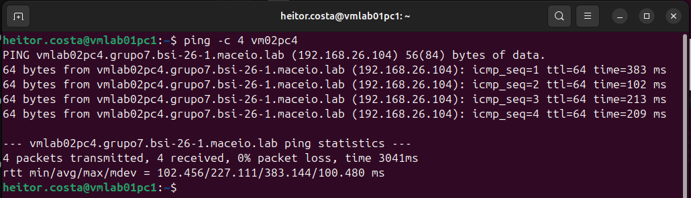

## 6.1 Ping com IP

### vmlab01pc1 para vm01pc2

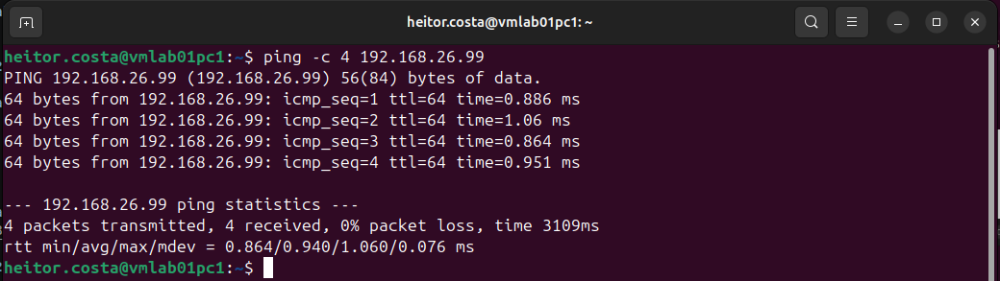

### vmlab01pc1 para vm02pc2

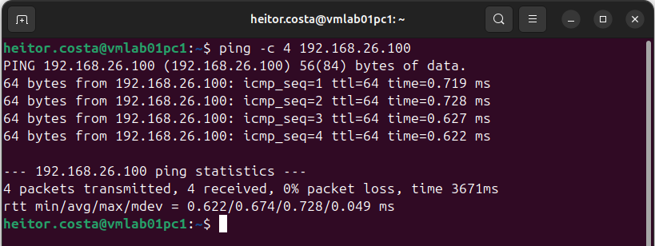

### vmlab01pc1 para vm01pc3

### vmlab01pc1 para vm02pc3

### vmlab01pc1 para vm01pc4

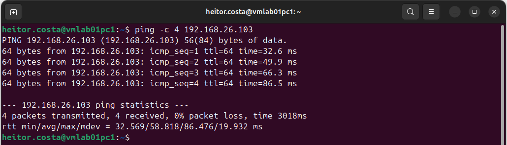

### vmlab01pc1 para vm02pc4

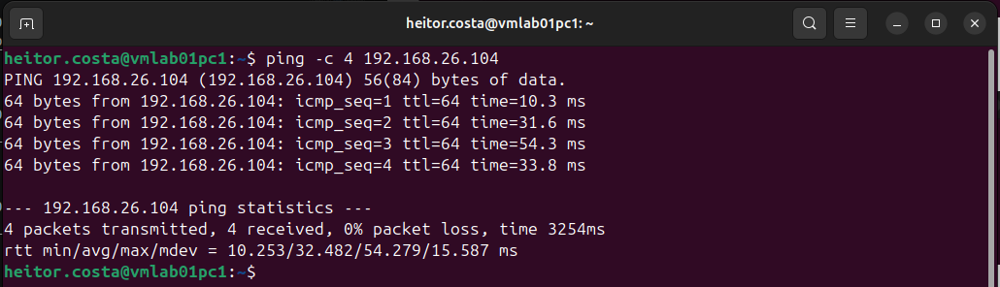
